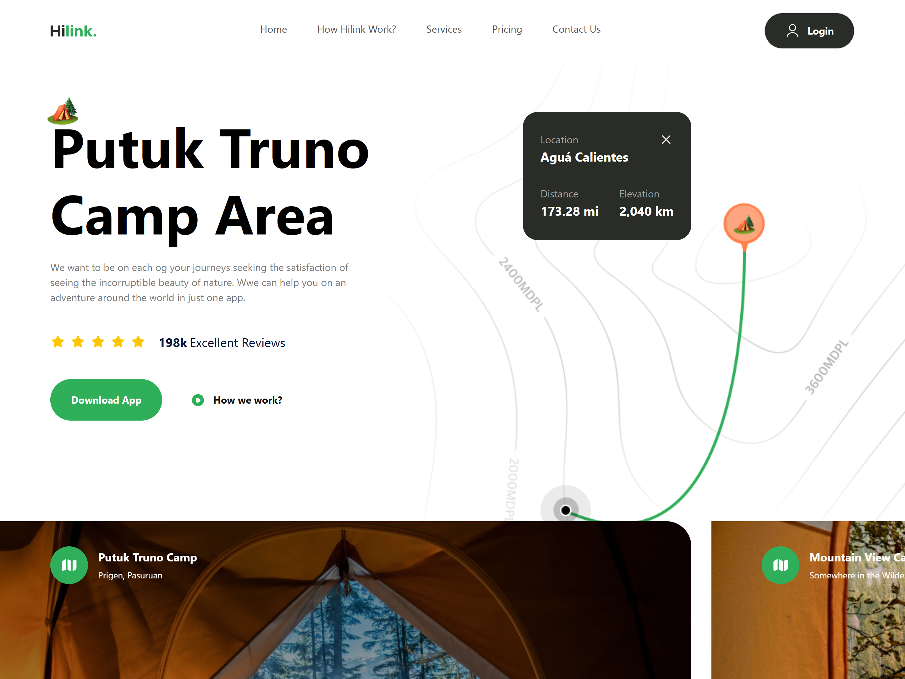

## Travel App

This project demonstrates the creation of a modern, fully responsive travel booking application using Next.js 14 and Tailwind CSS. The application features an elegant and intuitive UI/UX design tailored for seamless user experiences across devices. By leveraging the latest web technologies and best practices, this project serves as an ideal starting point for building scalable, visually appealing, and highly functional web applications.

